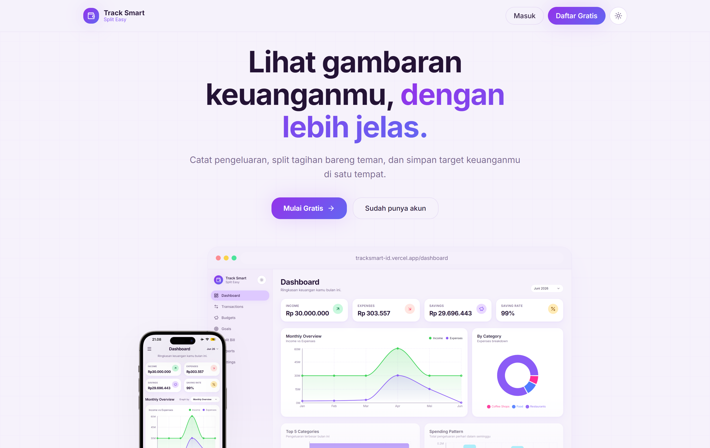
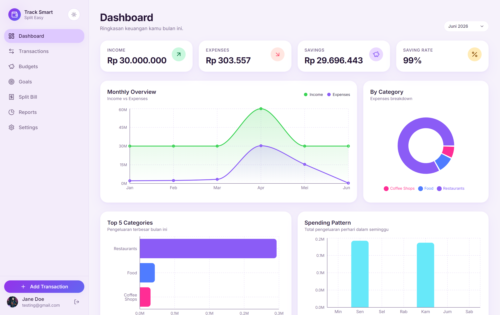
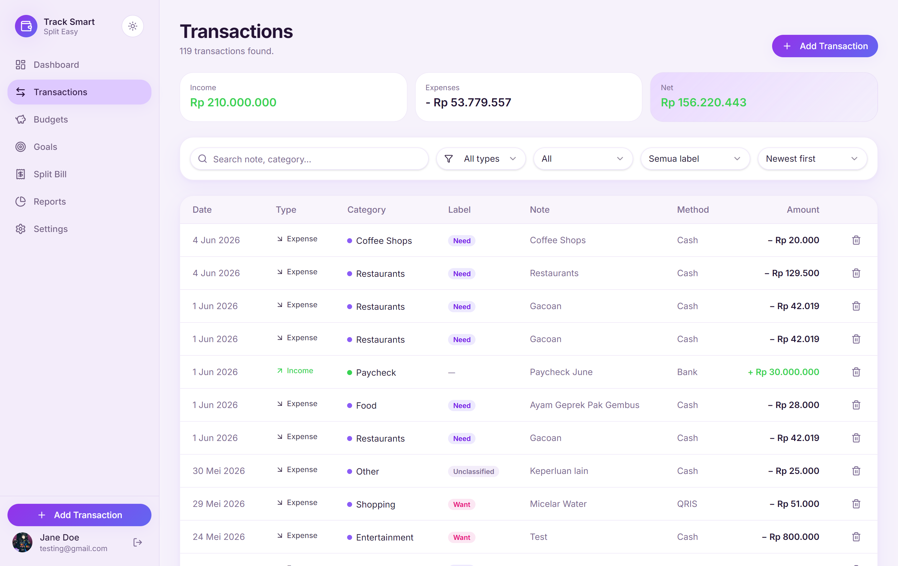
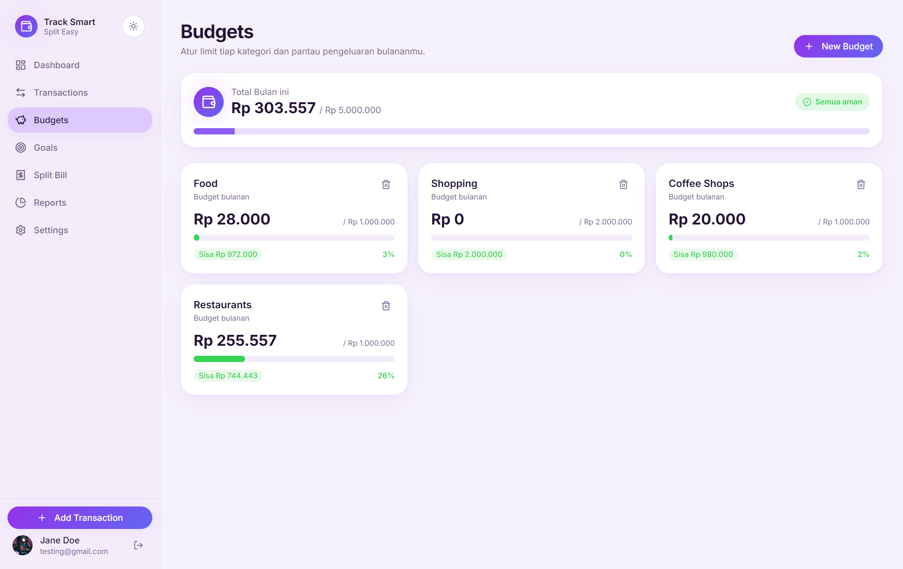
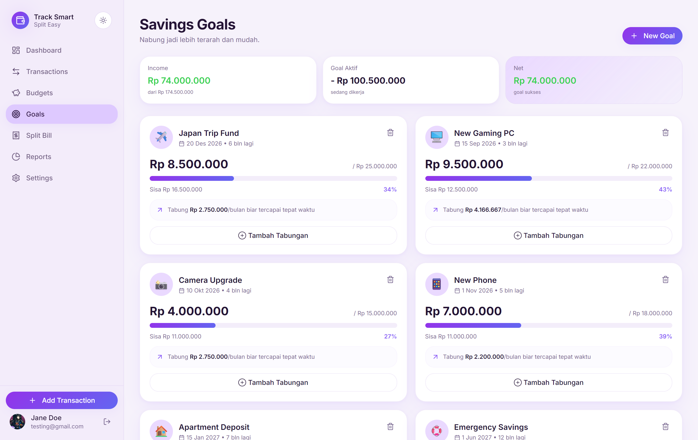
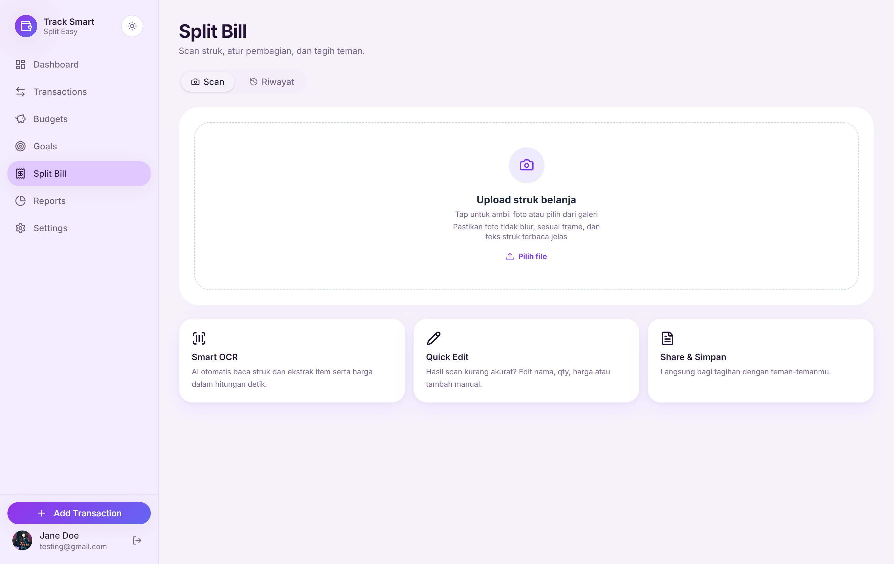
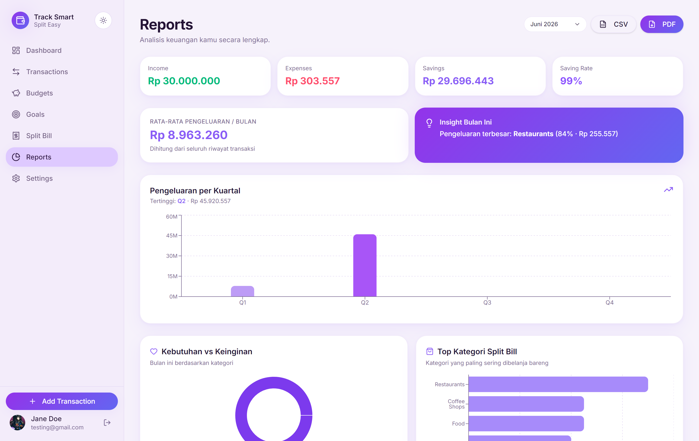
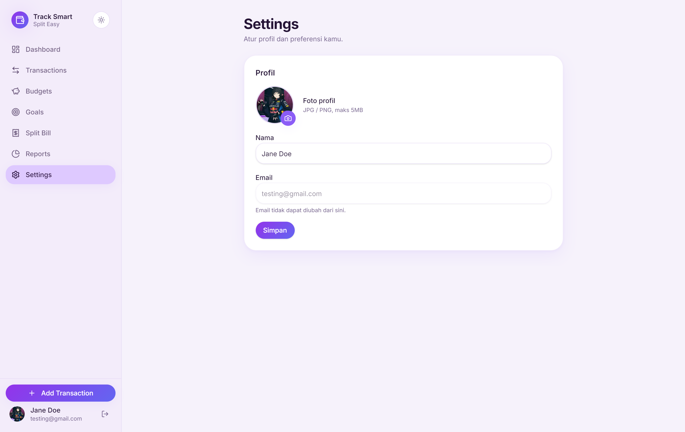

<div align="center">


<h2>Track Smart, Split Easy</h2>

Platform manajemen keuangan harian. Catat transaksi, atur budget, scan struk, split tagihan.


<table>
  <tr>
    <td></td>
    <td></td>
  </tr>
  <tr>
    <td></td>
    <td></td>
  </tr>
  <tr>
    <td></td>
    <td></td>
  </tr>
  <tr>
    <td></td>
    <td></td>
  </tr>
</table>
</div>

---

## Overview

**Track Smart, Split Easy** adalah platform manajemen keuangan harian berbasis web yang dibangun oleh tim lintas divisi Fullstack, Data Science, dan AI Engineer. Ide ini lahir dari satu masalah sederhana: pencatatan keuangan manual itu ribet, tidak konsisten, dan tidak menghasilkan insight apapun.

Aplikasi ini menggabungkan tiga hal sekaligus: pencatatan transaksi harian, analisis pengeluaran berbasis data, dan split bill otomatis dari foto struk menggunakan OCR dalam satu platform yang bisa diakses dari browser.

## Features

- **Dashboard:** Ringkasan keuangan bulanan: income, expenses, savings, saving rate, dan grafik tren.
- **Transactions:** Catat pemasukan & pengeluaran dengan label Need/Want, kategori, dan metode bayar.
- **Budgets:** Set limit pengeluaran per kategori dan pantau realisasinya secara visual.
- **Goals:** Buat target tabungan dengan deadline dan saran nominal bulanan otomatis.
- **Report & Insight:** Analisis per kuartal, pengeluaran terbesar, ekspor CSV & PDF.
- **Split Bill (OCR):** Scan struk → AI baca otomatis → assign ke orang → split dalam detik. Pajak & service charge dibagi proporsional.
- **Auth:** Login aman dengan Google SSO via Supabase Auth.

## Tech Stack

- **React + Vite** — Frontend dengan TanStack Router dan shadcn/ui.
- **Node.js + Express** — Backend REST API.
- **Supabase** — PostgreSQL database dengan Row Level Security dan Auth.
- **FastAPI + PaddleOCR** — Microservice untuk baca struk dan klasifikasi item.
- **Gradio (HuggingFace)** — Endpoint classifier kategori pengeluaran.
- **Streamlit** — Dashboard analisis Data Science.

---

## Getting Started

### Prerequisites

Sebelum mulai, pastikan ini sudah ada di laptop kamu:

- [Node.js](https://nodejs.org/) v20+ — cek dengan `node -v`
- [Python](https://www.python.org/) v3.9+ — cek dengan `python --version`
- Akun [Supabase](https://supabase.com) — free tier sudah cukup

## Installation

1. **Clone the repository**

   ```bash
   git clone https://github.com/vinda-in-git-code/track-smart.git
   cd track-smart
   ```

2. **Install dependencies**

   ```bash
   # Frontend + Backend (dari root)
   npm install

   # Lalu masuk ke server dan install juga
   cd server && npm install && cd ..

   # OCR Service
   cd "paddle ocr and classifier"
   pip install -r requirements.txt
   cd ..

   # Streamlit Dashboard
   pip install -r requirements.txt
   ```

3. **Setup database**

   Buka [Supabase SQL Editor](https://supabase.com/dashboard), copy semua isi file [`database/schema.sql`](./database/schema.sql), paste, lalu run. Semua tabel langsung terbuat sekaligus.

4. **Set up environment variables**

   Buat file `.env` di root folder dan isi variabel berikut:

   ```env
   # Supabase
   SUPABASE_SERVICE_ROLE_KEY=   # Supabase > Settings > API > service_role key
   VITE_SUPABASE_URL=           # Supabase > Settings > API > Project URL
   VITE_SUPABASE_ANON_KEY=      # Supabase > Settings > API > anon/public key

   # OCR & AI
   OCR_SERVICE_URL=             # URL FastAPI OCR, e.g. http://localhost:8000
   CLASSIFIER_SPACE=            # Gradio Space ID, e.g. username/space-name
   CLASSIFIER_API_NAME=         # Nama endpoint Gradio, e.g. /predict

   # App
   FRONTEND_URL=                # e.g. http://localhost:5173
   VITE_API_URL=                # URL backend, e.g. http://localhost:5000 atau http://localhost:3001
   ```

5. **Start the development server**

   Dari root folder, satu command untuk jalanin frontend + backend sekaligus:

   ```bash
   npm run dev
   ```

   - Frontend → `http://localhost:5173`
   - Backend → `http://localhost:5000` atau `http://localhost:3001`

   Jika ingin dijalankan secara terpisah:

   ```bash
   npm run dev:client   # frontend aja
   npm run server       # backend aja
   ```

   Untuk OCR Service, buka terminal baru:

   ```bash
   cd "paddle ocr and classifier"
   uvicorn app:app --reload --port 8000
   ```

   Untuk Streamlit Dashboard:

   ```bash
   streamlit run dashboard.py
   ```

---

## Database

Schema lengkap ada di [`database/schema.sql`](./database/schema.sql). Tinggal jalankan sekali di Supabase SQL Editor, semua tabel langsung terbuat. Row Level Security (RLS) aktif di semua tabel — tiap user cuma bisa akses data miliknya sendiri.

| Tabel | Keterangan |
|---|---|
| `profiles` | Data user  |
| `transactions` | Pencatatan pemasukan & pengeluaran |
| `budgets` | Limit pengeluaran per kategori per bulan |
| `goals` | Target tabungan |
| `split_bills` | Riwayat split bill dari hasil OCR |
| `user_roles` | Role management (admin/user) |

---

## Deployment

| Bagian | Platform | Catatan |
|---|---|---|
| Frontend | [Vercel](https://vercel.com) | Connect repo, auto-deploy dari `main` |
| Backend | [Railway](https://railway.com/) | Node.js web service, root dir: `server/` |
| OCR Service | [Hugging Face](https://huggingface.co/) | Python web service, root dir: `paddle ocr and classifier/` |
| DS Dashboard | [Streamlit Cloud](https://streamlit.io/cloud) | Connect repo, main file: `dashboard.py` |

Set environment variables yang sama di dashboard masing-masing platform. Ganti semua `localhost` dengan URL production.

---

## Tim

**CC26-PSU045** — Coding Camp 2026 powered by DBS Foundation
| Nama | Universitas | Role |
|---|---|---|
| Keysha Nur Khansa U | Institut Teknologi Indonesia | Fullstack Developer |
| Alayha Hafiz | Institut Teknologi Indonesia | Fullstack Developer |
| Vinda Karunia S | Universitas Tarumanegara | Data Science |
| Nabilah Yasmin Q | Universitas Budi Luhur | Data Science |
| Eko Hendrawan | Universitas Pamulang | AI Engineer |
| Jovalta Rokhianul Z E | Universitas Dian Nusantara | AI Engineer |

---

## License

Distributed under the MIT License. See [LICENSE](/LICENSE) for more information.